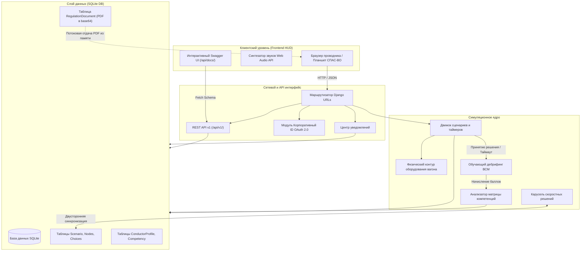
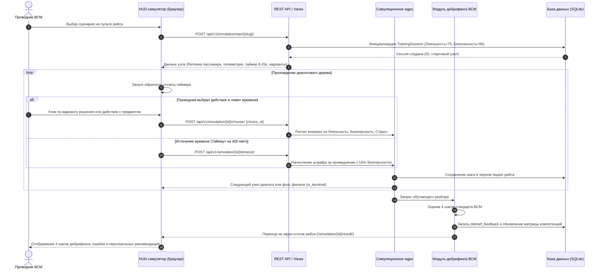

# Архитектура комплекса ВСМ-1 «Белый кречет»

Комплекс представляет собой распределенную веб-систему, разработанную на базе Python и Django с использованием интеллектуальных технологий (диалоговая языковая модель, нейросетевой синтез речи и локальное распознавание Whisper GGML/Vulkan).

## Системные компоненты

Система состоит из следующих функциональных уровней:

1. **Клиентский уровень (Frontend HUD)**
   - Адаптивный веб-интерфейс пульта проводника (HTML5, Modern CSS, Vanilla JS ES6+).
   - Интерактивная 3D/2D телеметрия скорости поезда, профиля перегона, температуры и давления в салоне.
   - Синтезатор сигналов оповещения Web Audio API (звуковой код ВСМ, предупреждающие сигналы, интерком).
   - Интерактивный Swagger UI для отладки и внешних интеграций (/api/docs/).

2. **Сетевой уровень и API-шлюз**
   - Маршрутизатор Django URL Router с поддержкой REST API v1.
   - Спецификация OpenAPI 3.0.3 (/api/v1/openapi.json).
   - Модуль аутентификации со сквозной поддержкой Корпоративный ID OAuth 2.0.
   - Шина оповещений и центр уведомлений проводника.

3. **Симуляционное ядро и бизнес-логика**
   - Движок ветвящихся диалоговых деревьев (Branching Scenario Engine).
   - Интерактивный физический контур вагона (стоп-кран, огнетушители ОВП, электрощит СКНБ, медаптечка, дефибриллятор АНД, терминал УКЭБ, чайный сервис).
   - Интеллектуальный таймер критических решений (8-25 секунд) с паузой на время речи и сетевых запросов.
   - Обучающий дебрифинг по 4-шаговой ролевой модели ВСМ.
   - Двусторонняя синхронизация с режимом «Карусель скоростных решений».

4. **Аналитический блок компетенций**
   - 6-осевой анализатор профессиональных компетенций с целевым нормативом 85%.
   - Векторный SVG-радар готовности проводника.
   - Алгоритм автоматического подбора персональной траектории устранения зон роста.

5. **Слой данных (Persistence Layer)**
   - Реляционная СУБД SQLite (db.sqlite3).
   - Хранение официальных нормативных актов СТО ВСМ и ПТЭ в виде base64-строк непосредственно в таблице RegulationDocument.
   - Потоковая отдача PDF-документов из памяти без зависимости от внешних файловых путей.

## Поток выполнения симуляции

## Отказоустойчивость и автономный режим

Комплекс спроектирован с учетом возможной потери связи при движении состава на перегонах со скоростью до 400 км/ч:
- Все 20 официальных сценариев и дерево ветвления предзагружены в локальную базу данных.
- Нормативные документы хранятся в базе данных в бинарном формате base64 и доступны без подключения к интернету.
- При недоступности облачных сервисов распознавание речи переключается на встроенный локальный движок Whisper (GGML/Vulkan), а синтез речи — на встроенный браузерный Web Speech API.
- Интерактивный HUD кэширует локальное состояние сессии в памяти браузера до восстановления синхронизации.
